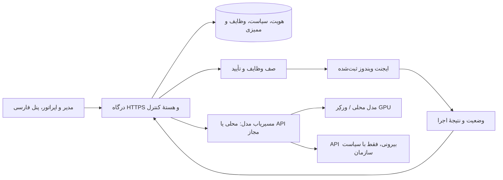

# طرح محصول OmniOps، نسخهٔ مستقل بعدی

وضعیت: طرح عملیاتی مبتنی بر کتابچهٔ ارسالی مالک محصول، ۱ اکتبر ۲۰۲۶

## تعریف محصول

OmniOps یک مرکز عملیات هوشمند خودمیزبان برای یک سازمان و حدود ۱۰ مدیر فناوری اطلاعات در انتشار نخست است. مدیر از پنل فارسی وضعیت زیرساخت و دستگاه‌های ثبت‌شده را می‌بیند، سؤال می‌پرسد، اقدام پیشنهادی را بررسی می‌کند و اجرای اقدامات مجاز را روی دستگاه مشخص تصویب می‌کند. سامانه نتیجه، هویت درخواست‌کننده، تأییدکننده و ایجنت اجراکننده را ثبت می‌کند.

اصل عملیاتی: استقرار و کارکرد پایه بدون اتصال به سرویس ابری ممکن باشد. اتصال به APIهای بیرونی قابلیت اختیاری هر سازمان است و خروج داده به بیرون در سیاست آن سازمان مشخص می‌شود.

کتابچهٔ ارسالی قابلیت‌های هدف را مشخص می‌کند: Master سبک و مستقل از بار مدل، استخر Worker، Edge، ایجنت Tauri ویندوز، پنل دوحالتهٔ گفتگو/وظیفه، مهارت‌ها، MCP، پیوست‌ها و حافظهٔ گفتگو. آنچه در مخزن پیشین به‌عنوان «پیاده‌سازی‌شده» آمده ملاک پذیرش نسخهٔ جدید نیست؛ هر قابلیت باید در محیط واقعی آزموده شود. نقشهٔ انطباق جزئی در `REQUIREMENTS_TRACE.fa.md` است.

## نقش‌ها و کار اصلی

| نقش | کار روزمره | حد اختیار پیش‌فرض |
|---|---|---|
| مدیر سامانه | نصب هسته، ثبت ایجنت و مدل، تعیین سیاست و بررسی رویدادها | مدیریت هویت و سیاست |
| اپراتور | مشاهدهٔ سلامت، درخواست عیب‌یابی و پیشنهاد اقدام | خواندن و درخواست اجرا |
| تأییدکننده | دیدن اثر اقدام بر دستگاه هدف و تصمیم دربارهٔ آن | تأیید اقدام در محدودهٔ مسئولیت |
| ایجنت ویندوز | گزارش وضعیت و اجرای وظیفهٔ مجاز روی دستگاه ثبت‌شده | تنها قابلیت‌ها و دامنهٔ تعیین‌شده |

پروفایل دسترسی قابل تعریف است: «فقط چت»، «چت و مهارت»، «مشاهدهٔ ابزارها»، «درخواست اقدام»، «تأیید اقدام» و «مدیریت سامانه» قابلیت‌های مستقلی هستند. مدیر اصلی می‌تواند چند قابلیت را در یک پروفایل جمع کند. هر اقدام اثرگذار به تأیید شخصی با قابلیت تأیید همان ابزار و همان دستگاه نیاز دارد؛ داشتن دسترسی چت به‌تنهایی اجازهٔ استفاده از ابزار نیست.

## تجربهٔ اصلی نسخهٔ اول

1. مدیر هسته را روی یک سرور نصب می‌کند و اولین حساب مدیریتی را با تنظیمات اختصاصی سازمان می‌سازد.
2. مدیر یک ایجنت ویندوز را با دعوت‌نامهٔ یک‌بارمصرف و محدود به زمان و دستگاه ثبت می‌کند؛ دستگاه و وضعیت ارتباط در پنل دیده می‌شود.
3. اپراتور در پنل فارسی یک دستگاه را انتخاب و دربارهٔ وضعیت پردازش، سرویس، دیسک یا شبکه سؤال می‌کند.
4. هسته دادهٔ تله‌متری واقعی را از ایجنت می‌گیرد. پاسخ هوش مصنوعی منشأ داده و مدل استفاده‌شده را نشان می‌دهد؛ اگر مدل در دسترس نیست، سامانه صادقانه خطا یا خروجی غیرهوشمند نشان می‌دهد.
5. اگر اقدامی لازم باشد، سامانه وظیفه‌ای ساختاریافته با هدف، پارامترها، اثر مورد انتظار و سطح خطر می‌سازد. تأییدکننده همان وظیفهٔ دقیق را تصویب یا رد می‌کند.
6. ایجنت فقط وظیفهٔ تصویب‌شده و مجاز را اجرا می‌کند؛ نتیجهٔ واقعی، خطا و زمان اجرا در دفتر رویدادها ثبت می‌شود. تأیید یک وظیفه مجوز اجرای وظیفهٔ دیگری نیست.

سه قابلیت عملیاتی نخست: گزارش واقعی CPU، RAM و دیسک؛ مشاهدهٔ سرویس‌ها و وضعیت شبکه؛ راه‌اندازی دوبارهٔ سرویس مشخص با تأیید مناسب پروفایل. برای رایانهٔ کاربر، اگر سیاست سازمان ایجاب کند، تأیید محلی نیز به تأیید مرکزی افزوده می‌شود.

پس از نصب هسته، راهنمای آغاز به کار مرحله‌ای نمایش داده می‌شود: ساخت مدیر و سازمان، انتخاب نحوهٔ دسترسی شبکه، ثبت اولین مدل محلی Ollama، تنظیم Providerهای بیرونی و SOCKS، ساخت پروفایل‌ها، ثبت اولین ایجنت، آزمون ارتباط و نخستین وظیفه. راهنما وضعیت واقعی هر مرحله و امکان بازگشت/ادامه را دارد.

## معماری عملیاتی پیشنهادی

در نسخهٔ اول هسته و درگاه می‌توانند روی یک سرور باشند. Edge عمومی با Caddy و تونل WireGuard، ورکِرهای چندگانه، RAG و MCP بعد از چرخهٔ واقعی ثبت، تأیید و اجرا اضافه می‌شوند. رابط Edge صرفاً یک درگاه است و تصمیم مجوز همیشه در هسته گرفته می‌شود. ارتباط ایجنت با هسته خروجی از سمت ایجنت است تا نیاز به باز کردن پورت ورودی روی دستگاه کاربران نباشد.

هسته یک درگاه سازگار با API متداول `/v1`، فهرست مدل‌ها، کلیدهای کلاینت و داشبورد Provider دارد. Ollama و Providerهای محلی مستقیم به شبکهٔ داخلی متصل‌اند. برای هر Provider بیرونی، مدیر بین ارتباط مستقیم و SOCKS انتخاب می‌کند؛ انتخاب SOCKS بدون اتصال معتبر اجازهٔ ارسال مستقیم به عنوان fallback ندارد. آزمون اتصال، کشف مدل‌های واقعی و انتخاب مدل برای هر Provider در پنل انجام می‌شود. 9Router می‌تواند پشت این درگاه به‌عنوان تجمیع‌کنندهٔ اختیاری Providerها اجرا شود؛ سیاست داده و پروفایل‌ها در OmniOps باقی می‌ماند. Jev، اگر با رضایت سازمان فعال شود، فقط انتخاب مدل را پیشنهاد می‌کند؛ انتخاب محلی و آفلاین نیز بدون آن کار می‌کند.

چت وب راست‌به‌چپ، شیشه‌ای و پاسخ‌گو به اندازهٔ صفحه است. ایجنت ویندوز تجربهٔ پنجرهٔ شناور و گفتگوی سریع مرجع را با هویت بصری اختصاصی OmniOps ارائه می‌دهد؛ نام، شخصیت و دارایی‌های Coucou/Mochi به مخزن عمومی منتقل نمی‌شوند. مرکز بصری چندعاملی نقش‌های مهندسی، مالی، پژوهش، حافظه، ویرایش و راهبرد را نشان می‌دهد؛ هر نقش وضعیت، اختیار و خروجی واقعی خود را دارد.

استقلال Master از بار مدل یک الزام معماری است؛ سقف مصرف RAM و هدف دسترس‌پذیری باید پس از تعیین سخت‌افزار و بار آزمون تعریف شوند. WireGuard برای سرورهاست؛ ایجنت ویندوز الزاماً عضو مش نیست و می‌تواند روی HTTPS با هویت دستگاهی به Master یا درگاه Edge متصل شود. هیچ پورت Worker در اینترنت عمومی ارائه نمی‌شود.

توپولوژی نهایی سه نقش مستقل دارد: Master کم‌مصرف برای هویت، مجوز و هماهنگی؛ Worker عملیاتی در شبکهٔ خصوصی برای مدل‌ها و پردازش‌های سنگین؛ و آینهٔ گرافیکی Edge روی سرور عمومی دیتاسنتر برای کاربران و ایجنت‌های خارج از سازمان. آدرس خصوصی محل آزمون و آدرس مدیریت Worker در کد، مستند عمومی یا فرمان نصب ثابت نمی‌شوند؛ هر گره هنگام استقرار با تنظیمات اختصاصی خودش ثبت می‌شود. قطع یا فشار Worker نباید پنل و احراز هویت Master را متوقف کند؛ خطای پردازش باید جداگانه نشان داده شود.

نصب Edge عمومی باید **نام دامنه را تعاملی بپرسد**، DNS و دسترسی لازم را بررسی کند، اتصال خصوصی Edge به Master را برقرار و آزمون کند و سپس Caddy را برای آن دامنه پیکربندی کند. صدور و تمدید گواهی TLS با ACME به عهدهٔ Caddy است؛ مدیر نباید فایل گواهی را دستی کپی کند. موفقیت نصب فقط پس از آزمون HTTPS از بیرون اعلام می‌شود. اگر دامنه، مسیر خصوصی یا صدور گواهی آماده نباشد، نصب با وضعیت خطای روشن متوقف می‌شود و هیچ URL عمومی HTTP برای ورود یا PIN منتشر نمی‌کند. دسترسی عمومی تنها روی Edge خواهد بود؛ Master و Worker در اینترنت باز نمی‌شوند. این قابلیت هدف مرحلهٔ استقرار چندگرهی است و هنوز پیاده‌سازی نشده است.

## مرزهای رفتار ایجنت

- حالت مشاهده: فهرست دستگاه، وضعیت و گزارش‌های خواندنی؛ حالت پیش‌فرض انتشار نخست.
- حالت اقدامِ تأییدشده: عملیات محدود و مشخص، با تأیید انسانی برای هر اقدام اثرگذار.
- حالت خودکار: فقط در نسخهٔ بعدی و در محدودهٔ سیاست قابل اندازه‌گیری، با امکان توقف و لغو.
- سوییچ «گفتگو / وظیفه» یک مرز مجوز است: تغییر ظاهر رابط به‌تنهایی دسترسی ابزار نمی‌دهد. هر عملیات هویت کاربر، مهارت/ابزار مجاز و محدودهٔ دستگاه را دوباره بررسی می‌کند.
- مهارت شامل دستورالعمل، ورودی/خروجی، قابلیت‌ها و نسخه است. یک پرامپت تخصصی به‌تنهایی «زیرایجنت مستقل» محسوب نمی‌شود؛ زیرایجنت واقعی چرخهٔ وظیفه، حالت، ابزار و گزارش قابل ردگیری دارد.
- مهارت‌ها در چت دستی یا با پیشنهاد هوشمند انتخاب می‌شوند. مهارت واردشده از Skillry یا منبع دیگر ابتدا منبع، مجوز، محتوا و قابلیت‌های درخواستی‌اش را نشان می‌دهد و تنها بعد از تأیید مدیر فعال می‌شود.
- ابزارهای MCP طبق [برنامهٔ اتصال](docs/MCP_INTEGRATIONS.fa.md) از طریق broker مرکزی و اجراکنندهٔ جدا متصل می‌شوند؛ دسترسی مرورگر محلی فقط از ایجنت همان دستگاه و ابزارهای ابری/عملیاتی از Worker مجاز انجام می‌شود. انتخاب مدل به‌تنهایی مجوز فراخوانی ابزار یا خروج داده نیست.
- متن چت، خروجی مدل و محتوای MCP دستور اجرایی محسوب نمی‌شوند. هسته وظیفهٔ ساختاریافته می‌سازد و هسته و ایجنت هر دو مجوز آن را بررسی می‌کنند.
- نبود ارتباط، نبود مدل، نبود ابزار یا خطای اجرا با وضعیت واقعی نمایش داده می‌شود؛ پاسخ ساختگی «موفق» مجاز نیست.

## نقشهٔ راه با معیار پذیرش

### مرحلهٔ ۰: تعیین محصول و جداسازی

- تصمیم دربارهٔ کاربران، اولین اقدامات، سیاست خروج داده و نحوهٔ استقرار.
- ایجاد مخزن مستقل با تاریخچه و نسخه‌گذاری جدا. کد مخزن موجود صرفاً پس از بررسی عملکرد و حق استفاده منتقل شود.
- نگارش وضعیت قابلیت‌ها با سه برچسب «فعال»، «آزمایشی» و «برنامه‌ریزی‌شده».

### مرحلهٔ ۱: محصول قابل استفاده با یک هسته و یک ایجنت ویندوز

- نصب قابل تکرار، ورود امن، ثبت واقعی ایجنت، نمایش آنلاین/آفلاین، چند ابزار مشاهدهٔ واقعی.
- یک اقدام کم‌خطرِ مشخص با تأیید، اجرای واقعی، گزارش نتیجه و ردپای ممیزی.
- آزمون پذیرش روی ویندوز تمیز و سرور جدا؛ قطع شبکه، رد تأیید و وظیفهٔ دست‌کاری‌شده به‌درستی مدیریت شوند.
- بستهٔ نصب ویندوز واقعاً اجرا شود و فرایند انتشار در نبود باینری واقعی شکست بخورد.

### مرحلهٔ ۲: هستهٔ هوشمند هیبریدی

- مسیریابی واقعی میان مدل محلی و APIهای مجاز؛ کنترل دسترسی هر مدل و دستهٔ داده.
- ثبت مدل استفاده‌شده، زمان پاسخ و خطا؛ نبود مدل به معنای پاسخ نمایشی نیست.
- پیشنهاد اقدام مبتنی بر شواهد، بدون دادن اختیار اجرای آزاد به مدل.

### مرحلهٔ ۳: استقرار چندگرهی

- افزودن Edge و تونل واقعی، سپس Worker محاسباتی و Worker اسناد.
- ثبت امن نودها، سلامت‌سنجی، لغو دسترسی، بازیابی و آزمون قطع هر گره.
- RAG و MCP فقط با ابزارهای واقعی، محدودهٔ دسترسی و ممیزی هر فراخوانی.

### مرحلهٔ ۴: بهره‌برداری سازمانی

- پشتیبان‌گیری و بازیابی آزمایش‌شده، به‌روزرسانی و بازگشت نسخه، کنترل دسترسی سازمانی، مشاهده‌پذیری، مستند نصب و پشتیبانی.
- نسخهٔ پایدار تنها پس از گذراندن آزمون‌های پذیرش امنیتی و عملیاتی منتشر شود.

## تصمیم‌های قطعی و موارد نیازمند نمونهٔ عملی

- انتشار نخست برای یک سازمان با ۱۰ مدیر است؛ مخزن مستقل عمومی با نام `RedBoy-011/OmniOps` خواهد بود.
- سه قابلیت نخست ایجنت: تله‌متری CPU/RAM/دیسک، گزارش سرویس/شبکه، و راه‌اندازی دوبارهٔ سرویس مشخص با تأیید متناسب با پروفایل.
- در پروفایل، چت، مهارت، ابزار، درخواست اقدام و تأیید اقدام جداگانه قابل اعطا هستند. جدایی درخواست‌کننده و تأییدکننده پیش‌فرض ایمن است و می‌تواند با سیاست مدیر اصلی تغییر کند.
- وضعیت پروکسی برای هر Provider بیرونی مستقل است؛ کارکرد آفلاین به Jev یا 9Router وابسته نیست.
- «Ember» نام چند محصول متفاوت است؛ تا دریافت نشانی دقیق پروژه، به عنوان اتصال عمومی به Provider سازگار در طرح باقی می‌ماند.
- نوع دستگاه‌های نخست (رایانهٔ کاربر یا سرور ویندوز)، مرز تأیید محلی کاربر و استقرار Edge در نصب اول را نمونهٔ عملی و سیاست سازمان تعیین می‌کند.

هیچ قابلیت پیش‌نمایش یا شبیه‌سازی‌شده‌ای «تکمیل‌شده» محسوب نمی‌شود.
