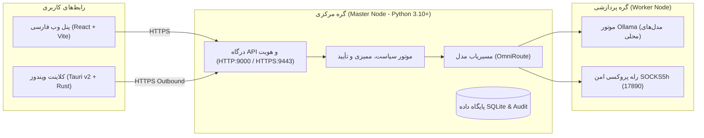

# OmniOps

<p align="center">
  
</p>

<h3 align="center">مرکز عملیات هوشمند و خودمیزبان سازمانی (Self-Hosted Intelligent Operations Center)</h3>

<p align="center">
  <strong>مدیریت زیرساخت، چت هوشمند با مدل‌های محلی و ابری، ایجنت ویندوز و کنترل وظایف با نظارت انسانی</strong>
</p>

<p align="center">
  
  
  
  
  
  
  
</p>

---

## 📌 معرفی پروژه

**OmniOps** یک پلتفرم عملیات هوشمند خودمیزبان (Self-Hosted) برای یک سازمان با حدود ۱۰ مدیر فناوری اطلاعات و اپراتور است. این سیستم به مدیران امکان می‌دهد وضعیت دستگاه‌ها و زیرساخت را در یک پنل وب مدرن فارسی پایش کنند، با مدل‌های زبانی محلی (**Ollama**) یا ابری (**Gemini / OpenAI / Anthropic**) بدون نشت داده گفتگو نمایند، و وظایف ساختاریافته را روی دستگاه‌های ثبت‌شده (از طریق کلاینت شناور ویندوز) با تأیید صریح انسانی اجرا کنند.

### ✨ ویژگی‌های کلیدی
* **محرمانگی داده (Data Sovereignty):** کارکرد پایه کاملاً محلی و آفلاین؛ هیچ داده‌ای بدون سیاست صریح و رضایت کاربر از شبکه خارج نمی‌شود.
* **مسیریابی هوشمند مدل (OmniRoute):** پشتیبانی از Ollama محلی روی Worker و اتصال امن به مدل‌های ابری از طریق رله SOCKS5h خصوصی.
* **نظارت انسانی (Human-in-the-Loop):** جداسازی نقش درخواست‌کننده از تأییدکننده؛ هیچ دستور اجرایی پرخطری بدون تصویب صریح مدیر انجام نمی‌شود.
* **کلاینت شناور ویندوز (Tauri Edge Agent):** ساخته‌شده با Rust و React با رابط کاربری شناور، فونت فارسی وزیرمتن و جفت‌سازی امن با پین ۶ رقمی.
* **پنل وب فارسی شیشه‌ای (Glassmorphism Web UI):** طراحی واکنش‌گرا و راست‌به‌چپ با React و Vite.

---

## 🏛️ معماری سه‌لایه‌ای سیستم



---

## 🚀 راهنمای نصب و راه‌اندازی گره‌ها (دستورات تک‌خطی)

### ۱. سرور اصلی (Master Node - لینوکس / اوبونتو)
سرور مرکزی هویت، پنل وب، سیاست‌ها و کنترل‌پلین سیستم است. برای نصب خودکار یا به‌روزرسانی:

```bash
bash -o pipefail -c 'curl -fsSL https://raw.githubusercontent.com/RedBoy-011/OmniOps/main/scripts/update-ubuntu.sh | bash'
```
> **ویژگی هوشمند:** این اسکریپت آی‌پی خصوصی سرور را خودکار تشخیص می‌دهد، پیش‌نیازها را نصب می‌کند، حساب مدیر ارشد را می‌سازد و در پایان آدرس ورود به پنل را تحویل می‌دهد.

---

### ۲. نود عملیاتی (Worker Node - پردازش مدل‌های محلی)
سرور پردازشی مجزا در شبکه خصوصی برای اجرای مدل‌های هوش مصنوعی (Ollama) و گزارش سلامت:

```bash
# روش پیشنهادی: اجرای دستور آماده با توکن تبادل (که روی Master با دستور omniops-token worker تولید می‌شود):
curl -fsSL https://raw.githubusercontent.com/RedBoy-011/OmniOps/main/scripts/setup-worker.sh | bash -s -- --token <JOIN_TOKEN>

# یا اجرای تعاملی:
bash -o pipefail -c 'curl -fsSL https://raw.githubusercontent.com/RedBoy-011/OmniOps/main/scripts/setup-worker.sh | bash'
```
> **اتصال خودکار:** این اسکریپت Ollama را نصب کرده، مدل انتخابی (مثل `qwen3:0.6b`) را دانلود می‌کند، آدرس Master و گواهی TLS را به صورت خودکار از توکن تبادل استخراج کرده و نود را در پنل Master متصل و سبز می‌کند.  
> *(برای صدور توکن تبادل در هر زمان، روی سرور Master دستور `omniops-token worker` را اجرا کنید).*

---

### ۳. سرور لبه شبکه اینترنتی (Edge Node - آینه عمومی اینترنتی)
سرور عمومی دارای آی‌پی پابلیک و دامنه، برای دسترسی امن از اینترنت به پنل با SSL خودکار (Caddy):

```bash
bash -o pipefail -c 'curl -fsSL https://raw.githubusercontent.com/RedBoy-011/OmniOps/main/scripts/setup-edge.sh | bash'
```
> **درگاه امن:** ترافیک اینترنتی از طریق دامنه با گواهی Let's Encrypt دریافت شده و بدون بازکردن پورت‌های Master در اینترنت، به صورت امن به پنل داخلی هدایت می‌شود.

---

### ۴. کلاینت ویندوز (Windows Edge Agent)
ایجنت شناور ویندوز برای پایش سخت‌افزاری و اجرای وظایف با نظارت انسانی:

1. به مخزن گیت‌هاب بروید: [`RedBoy-011/OmniOps`](https://github.com/RedBoy-011/OmniOps)
2. وارد تب **Actions** و گردش‌کار **Windows validation and installer** شوید.
3. از بخش **Artifacts** در پایین آخرین اجرای موفق، بستهٔ `omniops-windows-x64-unsigned-preview` را دانلود کنید.
4. فایل `OmniOps Windows Edge_0.1.0_x64-setup.exe` را نصب کرده و با پین ۶ رقمی دریافتی از پنل مدیر، کلاینت را متصل کنید.

---

### ۵. راه‌اندازی محلی روی ویندوز (محیط توسعه / تست آفلاین)
اگر می‌خواهید هسته و وب را به صورت لوکال روی ویندوز بالا بیاورید:
```powershell
# ساخت پنل فرانت‌اند
cd web/app; npm ci; npm run build; cd ../..

# اجرای سرور درگاه
$env:OMNIOPS_API_KEY = py -3 -c "import secrets; print(secrets.token_urlsafe(32))"
$env:OMNIOPS_SIGNING_KEY = py -3 -c "import secrets; print(secrets.token_urlsafe(48))"
py -3 -m omniops.bootstrap
py -3 -m omniops.server
```
پنل از آدرس `http://127.0.0.1:9000` در دسترس خواهد بود.

---

## 📊 وضعیت و درصد پیشرفت پروژه

مطابق با سند بازنگری نقشهٔ راه ۱۰ فازی ([`docs/PROGRESS_ROADMAP.fa.md`](docs/PROGRESS_ROADMAP.fa.md)):

| مرحله | وزن از کل | درصد تحقق | وضعیت فعلی |
| :--- | :---: | :---: | :--- |
| **۰. ساختار محصول و مخزن مستقل** | ۵٪ | **۱۰۰٪** | مخزن مستقل، معماری و ساختار قانونی نهایی است. |
| **۱. هویت، پروفایل و پنل** | ۷٪ | **۶۰٪** | ثبت‌نام، ورود، نشست‌ها، تأیید مدیر و پنل React فعال‌اند. |
| **۲. ایجنت ویندوز و ۳ کار روز اول** | ۱۲٪ | **۲۰٪** | اتصال و بیلد NSIS موفق؛ آزمون ۳ کار عملیاتی ویندوز در جریان است. |
| **۳. مدیریت مدل محلی/بیرونی** | ۱۰٪ | **۴۰٪** | اتصال به Ollama و Gemini via SOCKS فعال است؛ استریمینگ چت مانده است. |
| **۴. استقرار Master/Worker/Edge** | ۹٪ | **۲۵٪** | ارتباط Master و Worker با TLS خصوصی تایید شد؛ گره Edge مانده است. |
| **۵. گفتگو، پروژه و پیوست** | ۱۲٪ | **۲۰٪** | پروژه‌ها، پیش‌نویس وظایف و ذخیره پیوست پیاده شد؛ ارسال به مدل مانده است. |
| **۶. موتور وظیفه و ابزارهای کدنویسی** | ۱۶٪ | **۰٪** | طراحی اسکیما و سندباکس در برنامه فاز بعدی. |
| **۷. موتور دانش و اسناد (RAG)** | ۹٪ | **۰٪** | طرح پایلوت Khoj و پردازش اسناد در مرحله طراحی. |
| **۸. مرورگر، مهارت‌ها و MCP** | ۱۲٪ | **۰٪** | تحلیل ابزارهای ۹گانه MCP ثبت شده است. |
| **۹. زمان‌بندی پایدار و اعلان‌ها** | ۵٪ | **۰٪** | برنامه‌ریزی‌شده برای فازهای آتی. |
| **۱۰. انتشار پایدار و نصب پاک** | ۳٪ | **۰٪** | پس از تکمیل دروازه‌های امنیتی و آزمون‌های میدانی. |
| **مجموع کل پروژه** | **۱۰۰٪** | — | **۲۰٫۲۵٪ (هسته آزمایشی پایدار و تست‌شده)** |

---

## 🧪 آزمون‌ها و اعتبارسنجی (Tests)

هستهٔ پایتون دارای **۸۱ آزمون واحد و یکپارچه** با کتابخانه استاندارد است:

```bash
# اجرای آزمون‌ها با پایتون
py -3 -m unittest discover -s tests -v
# یا در لینوکس:
python3 -m unittest discover -s tests -v
```

> **نتیجه تست‌ها:** تمامی تست‌های مربوط به احراز هویت، درگاه مدل، امنیت SOCKS، ذخیره‌سازی پیوست و مهاجرت پایگاه‌داده با موفقیت پاس می‌شوند (`81 tests: 77 passed, 4 skipped`).

---

## 📚 ساختار و مستندات فنی پروژه

### طرح و نقشه راه
* 📘 [طرح محصول OmniOps](PRODUCT_BLUEPRINT.fa.md)
* 📋 [ردگیری نیازمندی‌ها و معیارهای پذیرش](REQUIREMENTS_TRACE.fa.md)
* 📈 [نقشهٔ راه مرحله‌ای و درصدهای پیشرفت](docs/PROGRESS_ROADMAP.fa.md)
* 🗺️ [طرح توسعه فضای کاری عامل‌محور](docs/AGENT_WORKSPACE_CAPABILITY_PLAN.fa.md)
* 🔍 [تطبیق نقشه ده‌فازی عامل و اصلاح ایمنی](docs/AGENT_10_PHASE_REVIEW.fa.md)
* 🤝 [راهنمای تحویل پروژه برای توسعه‌دهنده بعدی](docs/PROJECT_HANDOFF.fa.md)

### استقرار، شبکه و امنیت
* 🌐 [قرارداد درگاه مدل و راهنمای راه‌اندازی](docs/GATEWAY_AND_SETUP.fa.md)
* 🔄 [به‌روزرسانی تک‌خطی اوبونتو](docs/ONE_LINE_UPDATE.fa.md)
* 🐧 [اجرای آزمایشی هسته روی اوبونتو](docs/UBUNTU_TEST.fa.md)
* 🔒 [پورت‌ها، اقدامات امنیتی و دفتر استقرار](docs/SECURITY_PORT_REGISTER.fa.md)
* 🔐 [استقرار TLS خصوصی میان Master و Worker](docs/PRIVATE_LAN_TLS_WORKER.fa.md)
* 🖧 [نصب و استقرار Worker در شبکه خصوصی](docs/WORKER_DEPLOYMENT.fa.md)
* 🔀 [مرکز فرماندهی گره‌ها و مسیریابی مدل (OmniRoute)](docs/CONTROL_PLANE_AND_ROUTING.fa.md)
* 🤖 [مدیریت مدل و تنظیمات Provider و SOCKS](docs/PRIVATE_MODEL_PROVIDER.fa.md)
* 🔌 [برنامهٔ بررسی و اتصال ابزارهای MCP](docs/MCP_INTEGRATIONS.fa.md)

### کلاینت ویندوز و رابط کاربری
* 🪟 [راهنمای ساخت کلاینت ویندوز در GitHub Actions](docs/GITHUB_BUILD.fa.md)
* 🔑 [فرآیند ثبت‌نام و کدهای اتصال پین ۶ رقمی](docs/OTP_AND_REGISTRATION.fa.md)
* 🎨 [تطبیق رابط شناور ایجنت با مرجع Coucou](docs/COUCOU_AGENT_ADAPTATION.fa.md)
* 🔤 [راهنمای فونت فارسی وزیرمتن و مجوز OFL](docs/LOCAL_FONTS.fa.md)

---

## ⚖️ مجوز و انتساب (License)

کدهای این پروژه تحت [مجوز MIT](LICENSE) منتشر شده‌اند. فونت فارسی استفاده‌شده **وزیرمتن (Vazirmatn)** تحت مجوز آزاد OFL است. متن کامل انتساب و استفاده از منابع در [NOTICE.md](NOTICE.md) مستند شده است.
