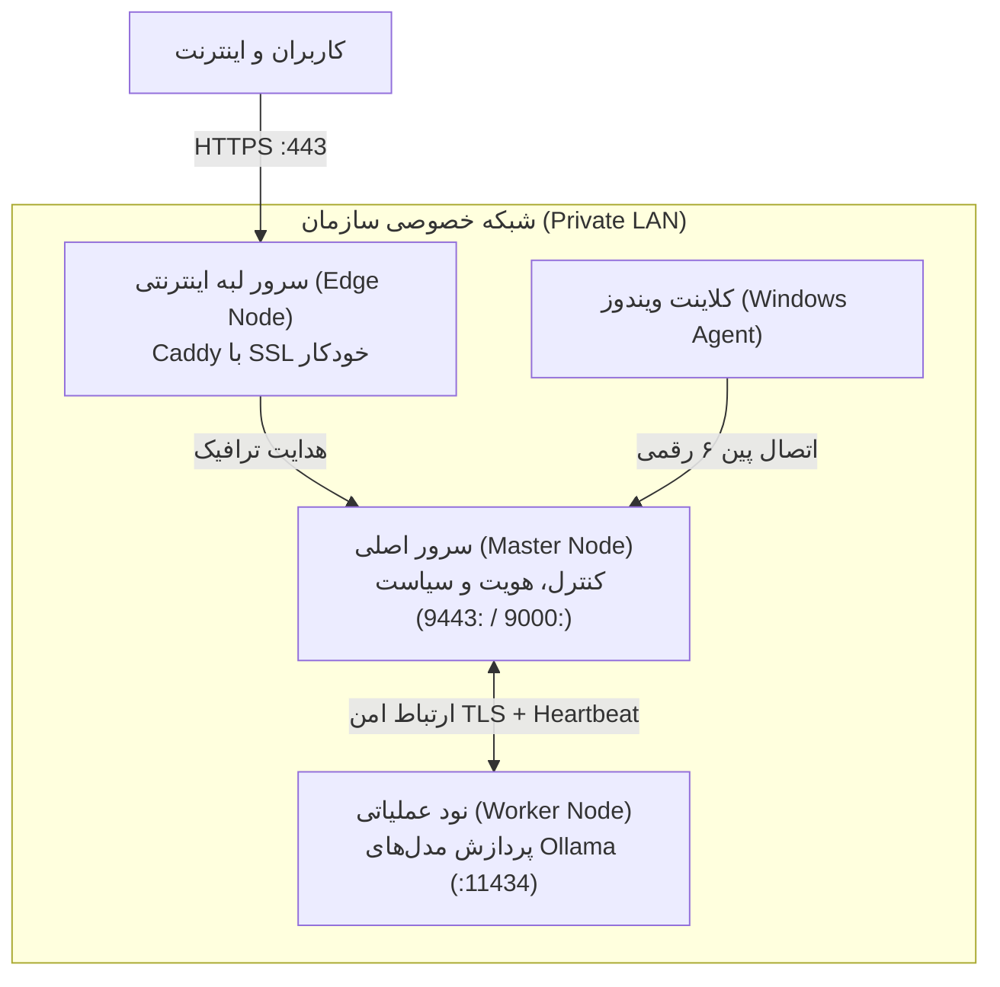

# راهنمای جامع دستورات تک‌خطی و اتصال گره‌های سه‌گانه OmniOps

این سند، راهنمای رسمی اجرای دستورات تک‌خطی و اتصال شبکه برای هر سه نقش اصلی معماری OmniOps است:
1. **سرور اصلی و مرکز فرماندهی (Master Node)**
2. **نود عملیاتی پردازش مدل و هوش مصنوعی (Worker Node)**
3. **سرور لبه شبکه اینترنتی / آینه عمومی (Edge Node)**

---

## 🏛️ معماری و نحوه تعامل گره‌ها



---

## ۱. سرور اصلی (Master Node)

سرور مرکزی مسئول پایگاه‌داده هویت، احراز هویت، صدور مجوزها، پنل وب فارسی، و مسیریابی مدل‌هاست.

### دستور تک‌خطی نصب و راه‌اندازی خودکار (Fresh Install یا به‌روزرسانی):
در ترمینال root سرور Master دستور زیر را اجرا کنید:

```bash
bash -o pipefail -c 'curl -fsSL https://raw.githubusercontent.com/RedBoy-011/OmniOps/main/scripts/update-ubuntu.sh | bash'
```

#### فرآیند خودکار اسکریپت Master:
1. **تشخیص خودکار آی‌پی:** آی‌پی محلی سرور (مثلاً `172.19.30.94`) را به طور خودکار استخراج کرده و برای تأیید نمایش می‌دهد (فقط کافیست Enter بزنید).
2. **ساخت حساب مدیر ارشد (SuperAdmin):** در اولین اجرا، نام کاربری، شماره همراه و رمز عبور مدیر را در ترمینال دریافت می‌کند.
3. **نصب وابستگی‌ها و بیلد وب:** Node 24، پایتون و نیازمندی‌های رمزنگاری را نصب کرده و پنل وب را می‌سازد.
4. **سرویس پایدار systemd:** سرویس `omniops-master.service` را فعال و استارت می‌کند.
5. **نمایش اطلاعات ورود:** آدرس نهایی پنل وب (مثلاً `http://172.19.30.94:9000/`) را نمایش می‌دهد.

---

## ۲. نود عملیاتی (Worker Node)

نود عملیاتی وظیفه میزبانی سرور هوش محلی **Ollama**، دانلود و اجرای مدل‌های سنگین (مانند `qwen3:0.6b` یا مدل‌های بزرگ‌تر) و ارسال تله‌متری به Master را بر عهده دارد.

### دستور تک‌خطی نصب و اتصال هوشمند Worker:
در سرور مجزایی که به عنوان Worker در شبکه خصوصی در نظر گرفته‌اید، دستور زیر را اجرا کنید:

```bash
bash -o pipefail -c 'curl -fsSL https://raw.githubusercontent.com/RedBoy-011/OmniOps/main/scripts/setup-worker.sh | bash'
```

### فرآیند اتصال خودکار به Master:
1. **نصب و راه‌اندازی Ollama:** اسکریپت موتور Ollama را به صورت محلی نصب کرده و مدل اولیه را دانلود می‌کند.
2. **آدرس سرور Master:** آدرس HTTPS سرور Master را می‌پرسد (مثال: `https://172.19.30.94:9443`).
3. **گواهی امنیتی CA:** گواهی عمومی `ca.crt` سرور Master را دریافت می‌کند تا ارتباطات کاملاً رمزگذاری‌شده و دوطرفه باشد.
4. **مجوز اتصال یک‌بارمصرف (One-Time Grant):**
   * برای دریافت این کد، کافیست روی سرور **Master** یک‌بار دستور زیر را بزنید:
     ```bash
     python3 -m omniops.node_admin --local-root --role worker
     ```
   * کد ۶۴ رقمی خروجی را در ترمینال Worker وارد کنید.
5. **ثبت سرویس و آغاز Heartbeat:** سرویس `omniops-worker-node.service` فعال شده و مشخصات پردازنده، حافظه و مدل‌های نصب‌شده را به Master مخابره می‌کند. کارت این Worker بلافاصله در پنل وب مدیر فعال و سبز می‌شود.

---

## ۳. سرور لبه شبکه اینترنتی (Edge Node / آینه عمومی)

سرور لبه روی یک سرور دارای آی‌پی عمومی اینترنتی قرار می‌گیرد و نقش محافظ امنیتی (Shield) را ایفا می‌کند تا کاربران از خارج از سازمان بتوانند از طریق اینترنت به پنل دسترسی داشته باشند، بدون اینکه هیچ پورتی از سرورهای Master یا Worker در اینترنت باز شود.

### دستور تک‌خطی راه‌اندازی سرور Edge:
در سرور لبه (دارای آی‌پی پابلیک و دامنه اینترنتی)، دستور زیر را اجرا کنید:

```bash
bash -o pipefail -c 'curl -fsSL https://raw.githubusercontent.com/RedBoy-011/OmniOps/main/scripts/setup-edge.sh | bash'
```

### فرآیند خودکار اسکریپت Edge:
1. **نصب وب‌سرور مدرن Caddy:** وب‌سرور Caddy به صورت خودکار نصب می‌شود.
2. **دریافت دامنه:** نام دامنه‌ای که به آی‌پی عمومی این سرور اشاره می‌کند را دریافت می‌کند (مثال: `ops.yourcompany.com`).
3. **دریافت مقصد داخلی Master:** آدرس آی‌پی داخلی Master در شبکه اختصاصی یا تونل WireGuard را می‌گیرد (مثال: `172.19.30.94:9000`).
4. **صدور گواهی خودکار SSL:** با استفاده از پروتکل ACME و Let's Encrypt گواهی معتبر HTTPS صادر و به طور خودکار تمدید می‌شود.
5. **فعال‌سازی سرویس:** سرویس Caddy فعال شده و پنل با آدرس امن `https://ops.yourcompany.com/` در سطح اینترنت در دسترس قرار می‌گیرد.

---

## 📋 جدول خلاصه دستورات تک‌خطی

| نقش گره | محیط اجرا | پورت‌های باز | دستور تک‌خطی راه‌اندازی |
| :--- | :--- | :--- | :--- |
| **Master Node** | سرور اصلی لینوکس در LAN | `9000` (وب/API) و `9443` (TLS گره‌ها) | `bash -o pipefail -c 'curl -fsSL https://raw.githubusercontent.com/RedBoy-011/OmniOps/main/scripts/update-ubuntu.sh \| bash'` |
| **Worker Node** | سرور پردازش مدل در LAN | `11434` (داخلی فقط برای Master) | `bash -o pipefail -c 'curl -fsSL https://raw.githubusercontent.com/RedBoy-011/OmniOps/main/scripts/setup-worker.sh \| bash'` |
| **Edge Node** | سرور عمومی اینترنت | `80` و `443` (عمومی با SSL) | `bash -o pipefail -c 'curl -fsSL https://raw.githubusercontent.com/RedBoy-011/OmniOps/main/scripts/setup-edge.sh \| bash'` |
| **Windows Agent** | سیستم کلاینت ویندوز | بدون نیاز به باز کردن پورت (اتصال خروجی) | دریافت نصب‌کننده از تب **Artifacts** در GitHub Actions مخزن |
